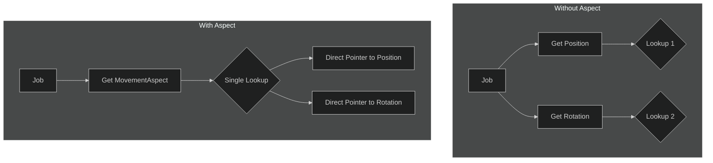

# API Reference: Aspects

Aspects are a primary performance feature in ME.BECS. They provide a high-speed, cached way to access a group of components for an entity, avoiding the repeated lookup costs associated with accessing each component individually. They are the recommended way to access component data within jobs.

## Why Use Aspects?

When you call `ent.Get<Position>()` and then `ent.Get<Rotation>()`, you are performing two separate dictionary-like lookups to find the memory location of each component's data.

An Aspect consolidates these lookups. When you define an Aspect, the framework generates code to cache the memory offsets of the components you declare. When you call `ent.GetAspect<MyAspect>()`, it performs a single operation to get a struct that has direct pointers to all the component data you need.



## Defining an Aspect

An Aspect is a `struct` that implements the `IAspect` interface.

### 1. Implement `IAspect`
This interface requires a single property:
```csharp
public interface IAspect {
    Ent ent { get; set; }
}
```
The framework uses this property to associate the Aspect instance with the entity it's operating on.

### 2. Declare Component Fields
Inside your Aspect struct, declare private fields for each component you want to access. These fields must be of type `RefRW<T>` or `RefRO<T>`.

*   `RefRW<T>`: Provides **Read-Write** access to the component data.
*   `RefRO<T>`: Provides **Read-Only** access. This is safer and can sometimes allow for better job scheduling.

### 3. Create Public Properties
Expose the component data through public C# properties. This provides a clean and safe API for your Aspect. The properties should use the `.Get(ent.id)` or `.Read(ent.id, ent.gen)` methods of the `Ref` structs.

### Full Example:

```csharp
using ME.BECS;
using ME.BECS.Math;

// The components we want to access
public struct Position : IComponent { public float3 value; }
public struct Rotation : IComponent { public quaternion value; }
public struct Scale : IComponent { public float3 value; }

// The Aspect definition
public struct TransformAspect : IAspect
{
    // 1. Required by IAspect
    public Ent ent { get; set; }

    // 2. Private fields for component access
    private RefRW<Position> position;
    private RefRW<Rotation> rotation;
    private RefRO<Scale> scale; // This component will be read-only

    // 3. Public properties for a clean API
    public ref float3 Position => ref this.position.Get(this.ent.id, this.ent.gen);
    public ref quaternion Rotation => ref this.rotation.Get(this.ent.id, this.ent.gen);
    public ref readonly float3 Scale => ref this.scale.Read(this.ent.id, this.ent.gen);

    // You can also add methods for complex logic
    public void LookAt(float3 target) {
        this.Rotation = quaternion.LookRotation(target - this.Position, math.up());
    }
}
```

## Using an Aspect

You can get an Aspect from any `Ent` instance.

### `ent.GetAspect<T>()`
Returns an instance of the Aspect for the given entity.
> **Note:** This method does not check if the entity actually has all the components defined in the Aspect. It assumes the query that found the entity has already validated this. For this reason, you should typically use Aspects in jobs that run on queries filtered for those components.

```csharp
// In a system's job
public void Execute(in Ent ent)
{
    var transform = ent.GetAspect<TransformAspect>();
    transform.Position.y += 1.0f;
    transform.LookAt(float3.zero);
}
```

### `ent.GetOrCreateAspect<T>()`
This is a convenience method that first ensures all components defined in the Aspect exist on the entity (adding them if necessary) and then returns the Aspect. This is useful for initialization logic but should be avoided in high-performance loops.
