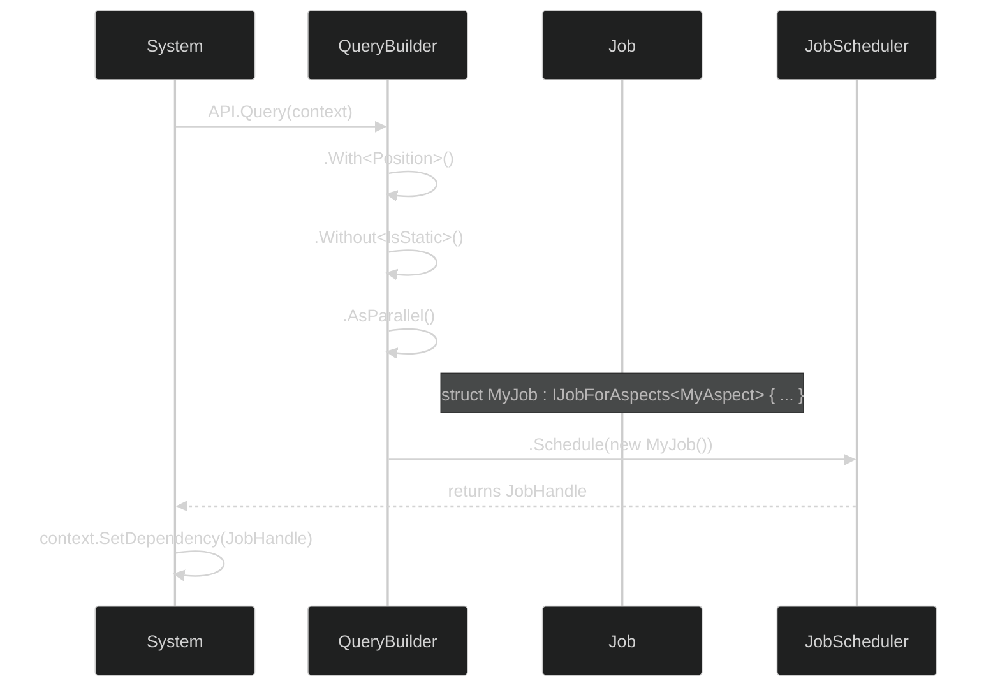

# API Reference: Queries & Jobs

Queries and Jobs are the heart of ME.BECS's data processing pipeline. **Queries** are used to select entities based on their components, and **Jobs** are used to perform work on those entities in parallel.

## The Query-Job-Schedule Workflow

The standard workflow involves three steps:
1.  **Build a Query:** Use the fluent `QueryBuilder` API to define which entities you are interested in.
2.  **Define a Job:** Create a `struct` that implements a job interface (e.g., `IJobForAspects`) and contains the logic to execute for each entity.
3.  **Schedule the Job:** Attach the job to the query and schedule it for execution, which returns a `JobHandle`.



## 1. Building a Query

You start a query by calling `API.Query()` or `context.Query()`. This returns a `QueryBuilder` struct that you can chain methods on.

```csharp
// Start a query within a system's context
var query = API.Query(in context);
```

### Filtering Methods

*   **`.With<T>()`**: Selects entities that **have** the component `T`.
*   **`.Without<T>()`**: Selects entities that **do not have** the component `T`.
*   **`.WithAll<T0, T1, ...>()`**: A convenience method to select entities that have **all** of the specified components.
*   **`.WithAny<T0, T1, ...>()`**: Selects entities that have **at least one** of the specified components.
*   **`.WithAspect<T>()`**: Selects entities that have all the components required by the Aspect `T`. This is the most common and performant way to build queries for jobs.

### Execution Mode

*   **`.AsParallel(uint batchCount = 64)`**: Specifies that the job should be run in parallel across multiple threads. `batchCount` defines how many entities are processed in a single batch per job.
*   **`.Sort()`**: Sorts the resulting entities by ID. This can improve memory access patterns in some cases.

---

## 2. Defining a Job

A job is a `struct` that implements a specific interface defining its `Execute` method.

### `IJobForAspects<TAspect>`
This is the most common and performant job type. It executes once for each entity that matches the query, providing direct access to the entity's data via an Aspect.

```csharp
[BurstCompile]
public struct MyJob : IJobForAspects<MyAspect>
{
    // The Execute method is called for each entity.
    public void Execute(in Ent ent, ref MyAspect aspect)
    {
        aspect.Position.y += 1.0f;
    }
}
```

### `IJobForComponents<T0, T1, ...>`
Similar to `IJobForAspects`, but provides direct `ref` access to individual components instead of an Aspect. This can be useful for simpler jobs where defining a full Aspect is overkill.

```csharp
[BurstCompile]
public struct MyComponentJob : IJobForComponents<Position, Rotation>
{
    public void Execute(in Ent ent, ref Position pos, ref Rotation rot)
    {
        pos.value.y += 1.0f;
    }
}
```

### Other Job Interfaces
*   **`IJobCommandBuffer`**: A single-threaded job that receives a `CommandBuffer` containing all matched entities.
*   **`IJobParallelForCommandBuffer`**: A multi-threaded job that receives a `CommandBufferJobParallel` for each entity.
*   **`IJobParallelForCommandBufferBatch`**: A multi-threaded job that receives a `CommandBufferJobBatch` containing a batch of entities to process.

---

## 3. Scheduling a Job

The final step is to schedule the job for execution. This is the terminal operation of the `QueryBuilder`.

### `.Schedule<TJob>(TJob job)`
This is the primary method for scheduling. You pass in an instance of your job struct.

```csharp
// In a system's OnUpdate method:
public void OnUpdate(ref SystemContext context)
{
    var query = API.Query(in context).WithAspect<MyAspect>().AsParallel();
    
    // Create an instance of the job and schedule it
    var jobHandle = query.Schedule(new MyJob());

    // IMPORTANT: Set the dependency for the framework to manage
    context.SetDependency(jobHandle);
}
```

> **Critical:** Always pass the returned `JobHandle` to `context.SetDependency()`. This allows ME.BECS's scheduler to manage job dependencies and execution, ensuring maximum parallelism. **Do not** call `.Complete()` on the handle yourself, as this will stall the main thread and negate the benefits of the job system.
