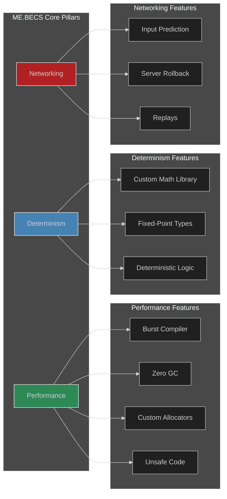

# 00: Introduction to ME.BECS

## What is ME.BECS?

ME.BECS (Bursted Entity Component System) is a high-performance, third-party ECS framework for Unity, designed from the ground up with a primary focus on **performance**, **determinism**, and **first-class networking**. It serves as a powerful alternative to Unity's native DOTS/ECS, offering a robust and opinionated architecture for building complex, scalable, and network-ready applications.

At its core, ME.BECS leverages the full power of Unity's Burst compiler, extensive use of `unsafe` C#, and custom memory allocators to achieve near-zero garbage collection (GC) and exceptionally fast run-time execution.

## Core Benefits & When to Choose ME.BECS

You should consider using ME.BECS for projects where the following are critical requirements:

#### 1. **Extreme Performance is Non-Negotiable**
The framework is built to squeeze the maximum performance out of the hardware.
*   **Burst & Unsafe:** Nearly 99% of the codebase is `unsafe` and designed to be compiled with Burst, eliminating overhead.
*   **Zero GC:** Custom memory management avoids GC pauses, which is critical for smooth gameplay in complex simulations.
*   **Direct Memory Access:** The API is designed to work in parallel jobs without the need to copy data to intermediate `NativeArray` containers.

#### 2. **Deterministic Simulation is Required**
ME.BECS guarantees that given the same sequence of inputs, the simulation will produce the exact same output every time. This is a foundational requirement for:
*   **Lockstep Networking:** Ensuring all clients in a multiplayer session remain perfectly synchronized.
*   **Replays:** Recording a stream of inputs is all that's needed to perfectly reconstruct a game session for debugging, analysis, or spectator modes.
*   **Fairness:** Eliminating simulation drift between clients in competitive games.

#### 3. **Complex Networking with Prediction & Rollback is a Core Feature**
Unlike many frameworks where networking is an afterthought, ME.BECS is built around a sophisticated networking model.
*   **First-Class Networking:** The framework includes built-in support for client-side prediction and server-side rollback.
*   **Smooth Experience:** Players experience a responsive, lag-free game, as their inputs are predicted locally. The framework automatically corrects any mispredictions based on the authoritative state from the server.
*   **Scalability:** The architecture is designed to handle the demands of real-time multiplayer games.

In summary, choose **ME.BECS** when you are building a demanding, simulation-heavy game (like an RTS, MOBA, or physics-based sandbox) where performance and network synchronization are paramount. It provides a complete, end-to-end solution for these challenges, complete with a rich set of editor tools to streamline development.
