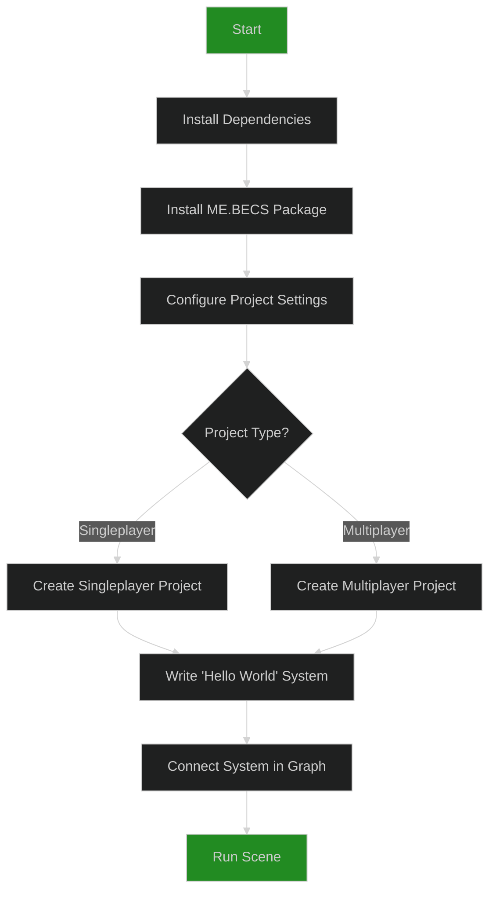

# 01: Getting Started with ME.BECS

This guide will walk you through the initial setup of a ME.BECS project in Unity.



## 1. Prerequisites & Dependencies

ME.BECS requires **Unity 2023.1 or later**.

Before installing the framework, ensure your Unity project's `manifest.json` includes the following packages. You can add them via the Unity Package Manager.

```json
"dependencies": {
    "com.unity.collections": "2.5.2",
    "com.unity.burst": "1.8.19",
    "com.unity.mathematics": "1.3.2",
    "com.unity.profiling.core": "1.0.2",
    "com.unity.ui": "2.0.0"
  }
```

## 2. Installation

Install the framework using the Unity Package Manager:

1.  Go to **Window > Package Manager**.
2.  Click the **'+'** icon and select **"Add package from git URL..."**.
3.  Enter the following URL: `https://github.com/chromealex/ME.BECS.git`
4.  Click **Add**.

## 3. Project Configuration

There are two critical configuration steps you must perform.

### a) Allow Unsafe Code

ME.BECS relies heavily on `unsafe` code for performance.

1.  Go to **Edit > Project Settings > Player**.
2.  In the **Other Settings** section, find **Additional Compiler Arguments**.
3.  Tick the **"Allow 'unsafe' Code"** checkbox.

### b) Create `csc.rsp` File

The framework uses a `csc.rsp` file to enable specific features and exceptions.

1.  In your project's `Assets` directory, create a new text file named `csc.rsp`.
2.  Add the following lines to the file. These are recommended for development. For release builds, you might remove the `EXCEPTIONS` and `CHECKS` defines for a slight performance boost.

```
-define:EXCEPTIONS_CONTEXT
-define:EXCEPTIONS_THREAD_SAFE
-define:EXCEPTIONS_COLLECTIONS
-define:EXCEPTIONS_COMMAND_BUFFER
-define:EXCEPTIONS_ENTITIES
-define:EXCEPTIONS_QUERY_BUILDER
-define:EXCEPTIONS_INTERNAL
-define:EXCEPTIONS_ASPECTS
-define:EXCEPTIONS
-define:ENABLE_BECS_COLLECTIONS_CHECKS
```

## 4. Creating Your First Project

ME.BECS provides a template generator to scaffold your project structure.

1.  In the Project window, right-click and select **Create > ME.BECS > Create Project**.
2.  Enter a name for your project (e.g., `MyGame`).

This action generates a `MyGame` folder with the necessary subdirectories and creates a `MyGameInitializer` prefab in your current scene. This initializer is the entry point for your ECS world.

## 5. "Hello World": Creating a System

Let's create a simple system that logs a message to the console.

1.  Inside the newly created `MyGame/System` folder, create a new C# script named `HelloWorldSystem.cs`.
2.  Replace its content with the following code:

    ```csharp
    using ME.BECS;
    using UnityEngine;

    namespace MyGame.System
    {
        // Systems are structs that implement interfaces like IAwake, IUpdate, etc.
        public struct HelloWorldSystem : IAwake
        {
            // OnAwake is called once when the world is created.
            public void OnAwake(ref SystemContext context)
            {
                Debug.Log($"Hello from the {context.world.Name} world!");
            }
        }
    }
    ```
    > **Constraint:** All your project-specific components, systems, and aspects must be created inside your project's namespace and folder (`MyGame` in this case).

## 6. Connecting the System in the Feature Graph

Systems are not automatically discovered. You must explicitly add them to a **Feature Graph**, which controls the execution flow.

1.  In your project folder, find the `MyGame-FeatureGraph.asset` file and double-click it to open the Graph Editor.
2.  Right-click on an empty area in the graph and select **"Create System"**.
3.  In the new node, select `HelloWorldSystem` from the dropdown list.
4.  Connect the graph's `Start` node to your `HelloWorldSystem` node's input port.
5.  Connect the `HelloWorldSystem` node's output port to the graph's `Exit` node.
6.  Click **"Save Graph"** and then **"Compile Graph"** in the editor toolbar.

## 7. Run the Scene

Press **Play** in the Unity Editor. You should see the "Hello from the..." message in your console, confirming that your system was successfully executed by the framework. You have now successfully set up and run your first ME.BECS system!
