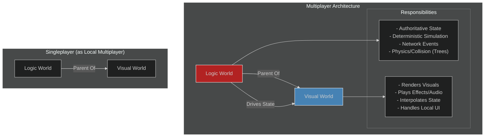

# 02: Core Architecture

Understanding the core architecture of ME.BECS is crucial for leveraging its power effectively. This document covers the three pillars of its design: the World Hierarchy, the execution model, and its unique approach to memory management.

## 1. The World Hierarchy: Logic vs. Visual

ME.BECS is fundamentally designed to support sophisticated networking models like client-side prediction and server rollback. This is achieved by separating the game state (**Logic**) from its on-screen representation (**Visual**). This separation is embodied through a parent-child **World Hierarchy**.



### Multiplayer Model

In a standard multiplayer setup, you have two distinct worlds running simultaneously:

1.  **Logic World:**
    *   This is the **authoritative** world. It runs the core game simulation.
    *   All logic within this world *must be deterministic*.
    *   It processes network inputs, runs game systems (e.g., unit movement, combat), and dictates the "true" state of the game.
    *   It has no concept of visuals, rendering, or Unity `GameObjects`.
    *   The `LogicInitializer` on the scene manages this world.

2.  **Visual World:**
    *   This world is a **child** of the Logic World (`VisualWorld.parent = LogicWorld`).
    *   Its sole purpose is to **observe** the state of the Logic World and present it to the player.
    *   It runs systems responsible for instantiating and updating `GameObjects` (via the Views Module), playing visual effects, and updating UI.
    *   It is not deterministic and can run cosmetic logic that doesn't affect gameplay.
    *   The `VisualInitializer` on the scene manages this world.

This separation is key to rollback networking: if the client mispredicts, the framework can roll back the **Logic World** to a previous state and resimulate, while the **Visual World** simply snaps to the newly corrected state.

### Singleplayer Model

For singleplayer games, you can use a single world. However, **it is highly recommended to adopt the multiplayer architecture even for singleplayer games**. Treating your singleplayer game as a "local multiplayer" session (where the client is also the server) provides two major benefits:

1.  **Scalability:** Your game is architecturally ready for multiplayer from day one.
2.  **Clarity:** It enforces a clean separation of concerns between game logic and presentation, leading to a more robust and maintainable codebase.

## 2. Execution Order & The Update Loop

System execution is not automatic. It is explicitly defined and controlled by the **Feature Graph**.

```mermaid
---
config:
  theme: dark
---
sequenceDiagram
    participant Unity
    participant BECS Initializer
    participant Feature Graph
    participant System A
    participant System B

    Unity->>BECS Initializer: Awake()
    BECS Initializer->>Feature Graph: ExecuteGraph()
    
    loop OnAwake
        Feature Graph->>System A: OnAwake(context)
        System A->>System B: OnAwake(context)
    end

    loop OnUpdate (every frame)
        Feature
        Feature Graph->>System A: OnUpdate(context)
        System A-->>Feature Graph: Returns JobHandle
        Feature Graph->>System B: OnUpdate(context, dependsOn: A's Handle)
        System B-->>Feature Graph: Returns JobHandle
    end
```

*   **Initializers:** The `WorldInitializer` (`LogicInitializer`, `VisualInitializer`) is a `MonoBehaviour` that kicks off the creation and execution of its associated world and Feature Graph. Script Execution Order is critical to ensure the Logic World is created before the Visual World.
*   **Feature Graph:** This is a visual scripting tool where you define the execution order of your systems. You connect nodes to dictate the flow for each phase of the game loop (`IAwake`, `IStart`, `IUpdate`, etc.).
*   **Job Dependencies:** Systems can schedule jobs and return a `JobHandle`. The Feature Graph automatically passes this handle to the next system in the chain, creating a dependency. This ensures that jobs are executed in the correct order and with maximum parallelism, without needing to manually call `JobHandle.Complete()`.

## 3. Memory Management: The Zero-GC Philosophy

ME.BECS is designed to avoid managed memory allocations during gameplay, thus eliminating garbage collection spikes.

*   **Custom Allocators:** The framework uses its own set of memory allocators (e.g., `WorldAllocator`, `TempAllocator`) built on top of Unity's `AllocatorManager`. All ECS data (entities, components) is stored in native memory managed by these allocators.
*   **Struct-Based:** All core data structures (`Ent`, components, aspects, systems) are `structs`. This avoids heap allocation and allows them to be used directly in Burst-compiled jobs.
*   **`unsafe` Code:** The framework extensively uses `unsafe` C# and pointers for direct memory manipulation, bypassing many of the overheads of the managed C# environment.
*   **`IDisposable`:** Worlds and other native collections must be disposed of correctly. The `WorldInitializer` handles the lifecycle of the main worlds, but any temporary worlds or collections you create must be managed manually, often with a `using` statement.
*   **Leak Detection:** The `LEAK_DETECTION` define can be enabled in the `csc.rsp` file during development to help identify memory leaks from undisposed native collections. This define carries a significant performance cost and should not be used in production builds.
