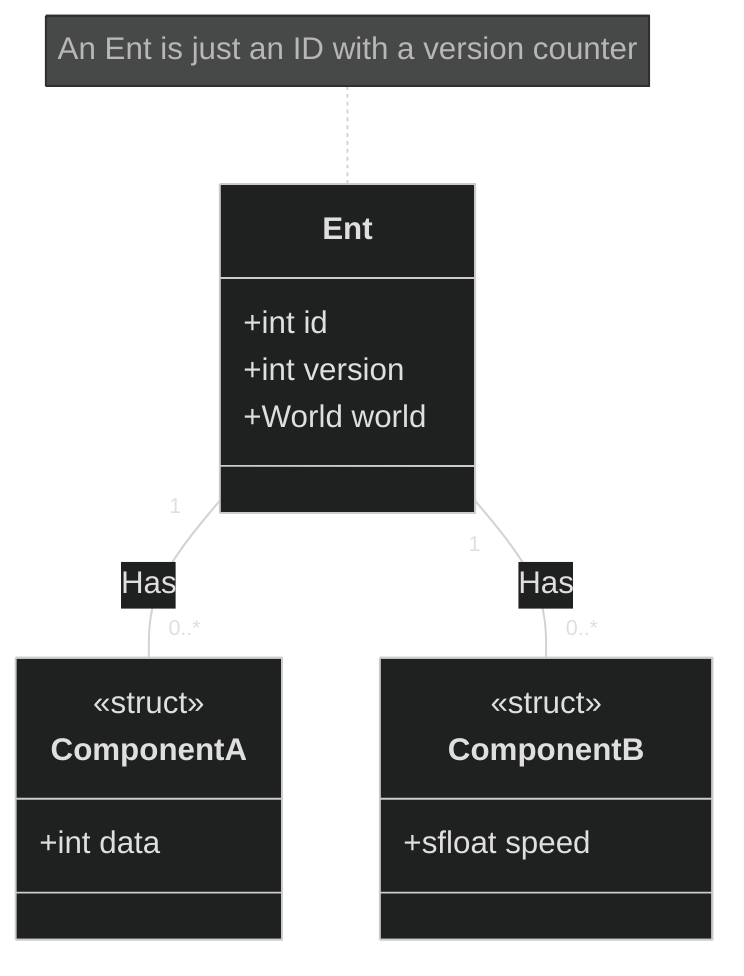
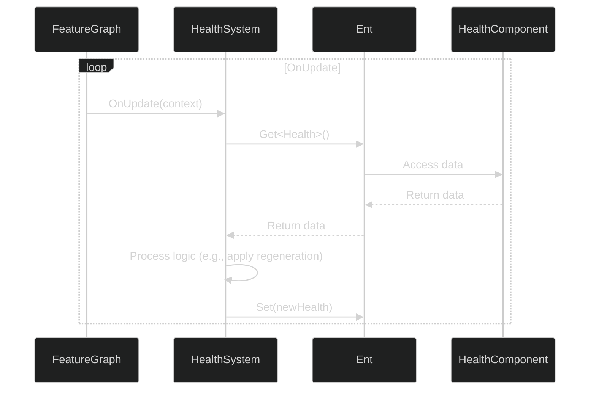

# 03: Fundamental Concepts

ME.BECS is built upon four fundamental concepts: **Entities**, **Components**, **Systems**, and **Aspects**. Mastering these building blocks is essential for working with the framework.

## 1. Entities: The "Things"

An **Entity** is a simple integer ID that represents an object in your world. It is a lightweight identifier that "owns" a collection of components.



### Key Characteristics:

*   **Identity:** An `Ent` struct holds an ID, a version, and a reference to the world it belongs to.
*   **Versioning:** The `version` is a counter that increments every time a component is added to, removed from, or modified on the entity. This is the cornerstone of the reactivity system used by Views.
*   **Lifecycle:** Entities are created and destroyed via the `Ent` API:
    ```csharp
    // Create a new entity in the current system's world context
    var newEntity = Ent.New(ref systemContext);

    // Destroy an entity
    newEntity.Destroy();
    ```
*   **No Data, No Logic:** An entity itself contains no data or logic. It is purely an identifier that groups components together.

## 2. Components: The Data

A **Component** is a `struct` that holds data for an entity. This is where all the state of your game lives.

### Critical Constraints & Best Practices:

Components in ME.BECS have strict rules to ensure performance and determinism.

1.  **Must be a `struct`:** Components cannot be classes.
2.  **Must be Blittable:** They must have a predictable memory layout across different architectures. This means:
    *   **NO `bool` types.** Use `byte` (0 or 1) instead.
    *   **NO reference types** (e.g., `string`, classes, managed arrays).
    *   **NO `char` types.**
3.  **Use Framework-Provided Types:**
    *   For floating-point math, use `sfloat` (a deterministic fixed-point type) or `tfloat` (which can be `float` or `sfloat` depending on defines).
    *   For collections, use the native collections provided by the framework (e.g., `ME.BECS.Collections.List<T>`).
4.  **Implement `IComponent`:** All components must implement the `IComponent` marker interface.

A typical component looks like this:

```csharp
using ME.BECS;
using ME.BECS.Math;

// All components must implement IComponent
public struct Health : IComponent
{
    public sfloat value;
    public sfloat maxValue;
}

public struct IsMoving : IComponent
{
    // Use byte for boolean flags
    public byte value; 
}
```

## 3. Systems: The Logic

A **System** is a `struct` that contains the logic to transform component data. Systems are where all the work happens in your application.



### Key Characteristics:

*   **Implement Interfaces:** Systems implement interfaces that hook into the world's lifecycle, such as:
    *   `IAwake`: Called once when the world is created.
    *   `IStart`: Called once after `IAwake`.
    *   `IUpdate`: Called every frame (or tick).
    *   `IDestroy`: Called when the world is disposed.
*   **Stateless by Default:** Systems should ideally be stateless. Any data they need should be queried from components. Public fields on a system `struct` are treated as injection points for configuration in the Feature Graph editor.
*   **Job-Based:** The primary role of a system is to schedule jobs that run in parallel, operating on component data.

## 4. Aspects: The High-Performance Accessor

An **Aspect** is a specialized `struct` that provides high-performance, direct access to a group of components for a single entity. It is the preferred way to work with component data inside jobs.

### Why Use Aspects?

Querying for each component individually (`ent.Get<A>()`, `ent.Get<B>()`) can be slow due to the lookups involved. An Aspect consolidates these lookups into a single operation, giving you direct memory references to the component data.

```csharp
using ME.BECS;

// Define the components
public struct Position : IComponent { public float3 value; }
public struct Velocity : IComponent { public float3 value; }

// Define the Aspect to group them
public struct MovementAspect : IAspect
{
    // This property is required by the IAspect interface
    public Ent ent { get; set; }

    // These fields provide direct, cached access to the component data.
    // Use RefRW for read/write access, or RefRO for read-only.
    private RefRW<Position> position;
    private RefRW<Velocity> velocity;

    // Public properties provide a clean API
    public ref float3 Position => ref this.position.Get(this.ent.id);
    public ref float3 Velocity => ref this.velocity.Get(this.ent.id);

    // You can also add methods for complex logic
    public void ApplyMovement(float deltaTime)
    {
        this.Position += this.Velocity * deltaTime;
    }
}

// In a system's job:
var aspect = ent.GetAspect<MovementAspect>();
aspect.ApplyMovement(deltaTime);
```

By using `MovementAspect`, you perform one lookup to get pointers to both `Position` and `Velocity`, which is significantly faster than two separate lookups, especially when processing thousands of entities in a tight loop.
