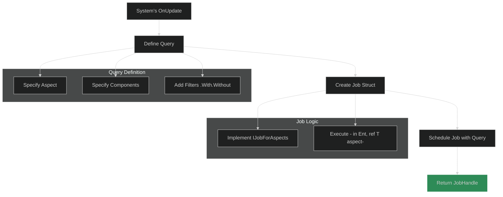
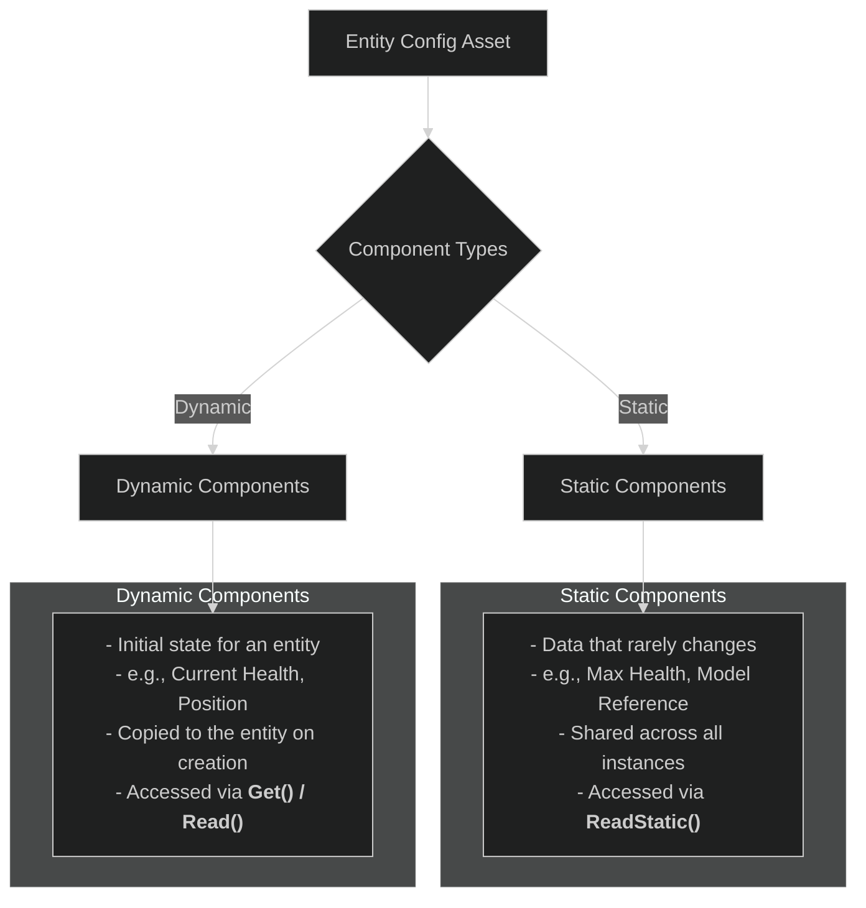
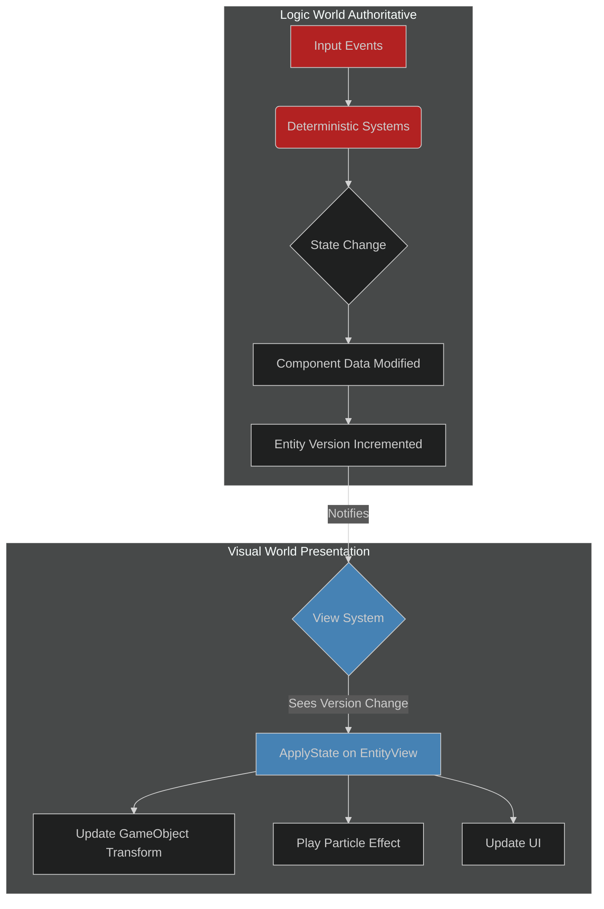

# 04: Data & Logic Workflows

This document covers the primary workflows for implementing game logic and managing data in ME.BECS. It focuses on how to query for entities, process them in parallel jobs, define their archetypes using configs, and orchestrate everything using the Feature Graph.

## 1. Queries & Jobs: Processing Data in Parallel

The core of most systems is to find a set of entities that have specific components and then process them. This is done through **Queries** and **Jobs**. The recommended and most performant approach is to use **Aspects** within your jobs.



### The Workflow

1.  **Define a Job:** Create a `struct` that implements one of the job interfaces, such as `IJobForAspects<T>`. The `Execute` method of this struct contains the logic that will run for each entity.
2.  **Define a Query:** In your system's `OnUpdate` method, use `API.Query()` to define which entities the job should run on. You specify the Aspect and any additional component filters.
3.  **Schedule the Job:** Call `.Schedule()` on the query, passing in an instance of your job struct. This returns a `JobHandle`.
4.  **Set Dependency:** Return the `JobHandle` from your system's `OnUpdate` method by passing it to `context.SetDependency()`. The framework will manage the job's completion.

### Example:

```csharp
using ME.BECS;
using ME.BECS.Jobs;

// Aspect defined in 03-Fundamental-Concepts.md
// public struct MovementAspect : IAspect { ... }

public struct MovementSystem : IUpdate
{
    // 1. Define the Job
    [BurstCompile]
    private struct MoveJob : IJobForAspects<MovementAspect>
    {
        // Inject the frame's delta time
        [InjectDeltaTime] public float deltaTime;

        public void Execute(in Ent ent, ref MovementAspect aspect)
        {
            aspect.Position += aspect.Velocity * this.deltaTime;
        }
    }

    public void OnUpdate(ref SystemContext context)
    {
        // 2. Define the Query for all entities with MovementAspect
        var query = API.Query(context);
        
        // 3. Schedule the Job
        var jobHandle = query.Schedule<MoveJob, MovementAspect>(new MoveJob());

        // 4. Set the dependency for the framework to manage
        context.SetDependency(jobHandle);
    }
}
```

> **Best Practice:** Always return the `JobHandle` via `context.SetDependency()`. Avoid calling `.Complete()` inside a system as it creates a sync point and stalls the main thread, defeating the purpose of multithreading.

## 2. Entity Configs: The "Prefab" System

**Entity Configs** are `ScriptableObject` assets that define an entity's archetype. They are the ME.BECS equivalent of Unity's prefabs, allowing you to define a template of components and their initial data.



### Key Features:

*   **Static Components:** Data that is shared by all entities created from this config. It's stored only once on the config itself, saving significant memory. Use this for data that doesn't change at runtime (e.g., unit type, max speed, a reference to a view prefab). Accessed via `ent.ReadStatic<MyComponent>()`.
*   **Dynamic Components:** Data that is copied to the entity when it is instantiated. This is the initial state of the entity (e.g., current health set to max health, initial position).
*   **Inheritance:** Configs can inherit from other configs, allowing you to create layered definitions (e.g., `BaseUnit` -> `InfantryUnit` -> `Rifleman`).
*   **Data-Driven Design:** Because configs are assets, they can be easily modified by designers. The **CSV Configs Importer** tool even allows you to import data directly from Google Sheets into your configs, enabling a powerful data-driven workflow.

## 3. The Feature Graph: Orchestrating Systems

The **Feature Graph** is a visual editor that defines the execution order and dependencies of all your systems. It is the central hub for controlling your application's logic flow.

*   **Visual Workflow:** Instead of managing execution order via attributes or complex code, you visually connect nodes in a graph.
*   **Execution Phases:** The graph has entry points for each lifecycle event (`Start`, `Update`, etc.), allowing you to define which systems run and in what order for each phase.
*   **Dependencies:** The graph automatically handles `JobHandle` dependencies. If System A's output is connected to System B's input, the framework ensures System A's jobs are completed before System B's jobs begin, or chains them appropriately.
*   **Features:** You can group systems into "Features" (other graphs), which can be enabled or disabled. This allows you to create modular blocks of functionality.

By combining Queries, Jobs, Configs, and the Feature Graph, you get a powerful and highly performant workflow for building complex game logic in a data-oriented and scalable way.

## 4. Hybrid & Main-Thread Systems

While `[BurstCompile]` jobs are the most performant way to process entities, not every task is performance-critical. For systems that run infrequently, need to interact with managed code (e.g., `Debug.Log`), or are simpler to write on the main thread, you can create a "hybrid" system without a job.

The workflow is simpler: you query for entities and then iterate over the results directly in your system's `OnUpdate` method.

> **Note:** This approach is less performant as it runs on the main thread and does not benefit from Burst or multithreading. It is best reserved for debugging, one-off tasks, or non-deterministic logic in the **Visual World**.

### Example: A Simple Main-Thread System

This system finds all entities with a `PlayerTag` and logs their position to the console, a classic debugging task.

```csharp
using ME.BECS;
using UnityEngine;

// A simple tag component to identify player entities.
public struct PlayerTag : IComponent {}

// A system to log player positions.
public struct DebugPlayerPositionSystem : IUpdate
{
    // Use [WithoutBurst] to explicitly mark the method as non-bursted,
    // allowing access to managed code like Debug.Log.
    [WithoutBurst]
    public void OnUpdate(ref SystemContext context)
    {
        // Build a query as usual.
        var query = API.Query(in context).With<PlayerTag>().With<Position>();
        
        // Get an enumerator and iterate directly.
        // This will block the main thread until the query is complete.
        foreach (var ent in query) 
        {
            // You can now access managed APIs and read component data.
            var pos = ent.Read<Position>().value;
            Debug.Log($"Player Entity {ent.id} is at position {pos}");
        }
    }
}
```

## 5. Logic vs. Visual World: Key Differences

A critical architectural pattern in ME.BECS is the separation of the **Logic World** (for gameplay simulation) and the **Visual World** (for rendering). Understanding their distinct roles and constraints is essential.



### Programming for the Logic World

Think of the Logic World as the **server**. It is the single source of truth for the game state.

*   **Goal:** 100% Determinism.
*   **Data:** Operates on core gameplay components (`Health`, `Velocity`, `Mana`, etc.).
*   **Constraints:**
    *   **Do Not** use most `UnityEngine` APIs (e.g., `Time.deltaTime`, `UnityEngine.Random`, `GameObject.Find`).
    *   **Do** use the framework's deterministic alternatives (`context.deltaTime`, `context.world.GetRandom()`).
    *   **Do Not** perform any rendering or direct visual updates.
*   **Output:** The result of logic systems is purely **data transformation**. When a component's data is changed, the entity's version is incremented. This version change is the signal the Visual World uses to update its presentation.

#### Example: Logic System
This system processes a one-shot `DamageEvent` component, reduces the entity's health, and is fully deterministic and Burst-compatible.

```csharp
public struct DamageEvent : IComponent {} // One-shot component
public struct Health : IComponent { public sfloat Value; }

[BurstCompile]
public struct ApplyDamageSystem : IUpdate
{
    public void OnUpdate(ref SystemContext context)
    {
        // Query for all entities that have both a DamageEvent and Health.
        var query = API.Query(in context).With<DamageEvent>().With<Health>().AsParallel();
        context.SetDependency(query.Schedule(new ApplyDamageJob()));
    }
}

[BurstCompile]
public struct ApplyDamageJob : IJobForComponents<Health>
{
    public void Execute(in Ent ent, ref Health health)
    {
        // Apply damage
        health.Value -= 10;
        // The one-shot event is automatically removed by the framework.
    }
}
```

### Programming for the Visual World

The Visual World is the **presentation layer**. It observes the Logic World and decides how to represent its state on screen.

*   **Goal:** Rendering, effects, audio, and UI.
*   **Data:** It can read data from the Logic World but **should not modify it**. It can have its own components that are purely for visual purposes (e.g., `FadeoutTimer`, `ParticleSystemReference`).
*   **Constraints:**
    *   It is non-deterministic and can use any Unity API.
    *   It should be treated as a "derived" data layer. Its state is a consequence of the Logic World's state.
*   **How Rendering Works (The Views Module):**
    1.  The `ViewsModule` is a system that runs in the **Visual World**.
    2.  It queries for entities in the **Logic World** that have a view-related component (e.g., a `ViewIdComponent`).
    3.  When it finds such an entity, it instantiates a corresponding `GameObject` prefab. This prefab must have an `EntityView` script on it.
    4.  The `EntityView` script holds a reference to the `Ent`. Each frame, it checks if the `Ent`'s version has changed.
    5.  If the version has changed, the `EntityView` calls the `ApplyState()` method on all of its attached `ViewModule` components (e.g., `TransformViewModule`, `HealthBarViewModule`), which then read the new data from the entity and update the `GameObject`'s properties.

#### Example: Visual System & ViewModule
This example shows how a health bar `GameObject` is updated in the Visual World by reacting to changes in the Logic World's `Health` component.

**1. The ViewModule (On the Health Bar Prefab)**
This `MonoBehaviour` reads the health data and updates a UI slider.

```csharp
using ME.BECS;
using ME.BECS.Views;
using UnityEngine.UI;

public class HealthBarViewModule : ViewModule 
{
    public Slider slider;

    // ApplyState is called by the EntityView ONLY when the entity's version changes.
    public override void ApplyState(in Ent ent)
    {
        // Read the Health component from the logic entity.
        if (ent.TryRead(out Health health) == true)
        {
            // Update the Unity UI Slider.
            this.slider.value = (float)health.Value;
        }
    }
}
```

**2. A Visual System (Optional, for advanced cases)**
While most view logic can live in `ViewModule`s, you can also have systems in the visual world. This system, for example, could apply a screen-shake effect when any player's health drops below a threshold—a purely visual effect.

```csharp
using ME.BECS;
using UnityEngine;

// This component would be added to the camera in the Visual World.
public struct ScreenShake : IComponent { public float Intensity; }

[WithoutBurst]
public struct PlayerLowHealthScreenShakeSystem : IUpdate
{
    public void OnUpdate(ref SystemContext context)
    {
        // Query the LOGIC world (the parent) for players with low health.
        var query = API.Query(in context.world.parent).With<PlayerTag>().With<Health>();
        
        bool anyPlayerLow = false;
        foreach (var ent in query)
        {
            if (ent.Read<Health>().Value < 20f)
            {
                anyPlayerLow = true;
                break;
            }
        }

        // Get the camera entity from our OWN (visual) world and apply the effect.
        var cameraEnt = context.world.GetCameraEnt();
        if (anyPlayerLow == true)
        {
            cameraEnt.Get<ScreenShake>().Intensity = 1f;
        }
        else
        {
            cameraEnt.Get<ScreenShake>().Intensity = 0f;
        }
    }
}
```
