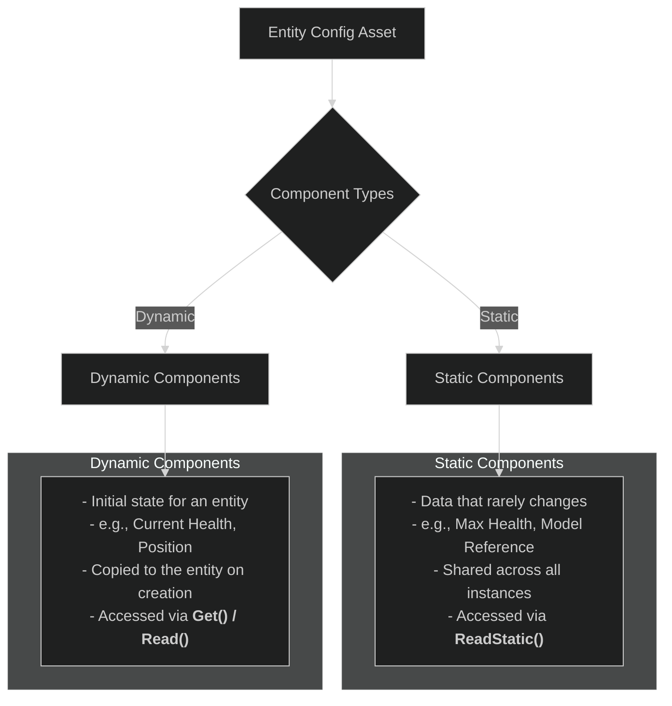

# 04: Data & Logic Workflows

This document covers the primary workflows for implementing game logic and managing data in ME.BECS. It focuses on how to query for entities, process them in parallel jobs, define their archetypes using configs, and orchestrate everything using the Feature Graph.

## 1. Queries & Jobs: Processing Data in Parallel

The core of most systems is to find a set of entities that have specific components and then process them. This is done through **Queries** and **Jobs**. The recommended and most performant approach is to use **Aspects** within your jobs.

```mermaid
---
config:
  theme: dark
---
graph TD
    A[System's OnUpdate] --> B[Define Query];
    B --> C[Create Job Struct];
    C --> D[Schedule Job with Query];
    D --> E[Return JobHandle];

    subgraph Query Definition
        direction LR
        B1[Specify Aspect<T>]
        B2[Specify Components<A, B>]
        B3[Add Filters .With<C>.Without<D>]
    end
    
    subgraph Job Logic
        C1[Implement IJobForAspects<T>]
        C2[Execute(in Ent, ref T aspect)]
    end

    B --> B1 & B2 & B3
    C --> C1 & C2

    style E fill:#2E8B57,stroke:#fff
```

### The Workflow

1.  **Define a Job:** Create a `struct` that implements one of the job interfaces, such as `IJobForAspects<T>`. The `Execute` method of this struct contains the logic that will run for each entity.
2.  **Define a Query:** In your system's `OnUpdate` method, use `API.Query()` to define which entities the job should run on. You specify the Aspect and any additional component filters.
3.  **Schedule the Job:** Call `.Schedule()` on the query, passing in an instance of your job struct. This returns a `JobHandle`.
4.  **Set Dependency:** Return the `JobHandle` from your system's `OnUpdate` method by passing it to `context.SetDependency()`. The framework will manage the job's completion.

### Example:

```csharp
using ME.BECS;
using ME.BECS.Jobs;

// Aspect defined in 03-Fundamental-Concepts.md
// public struct MovementAspect : IAspect { ... }

public struct MovementSystem : IUpdate
{
    // 1. Define the Job
    [BurstCompile]
    private struct MoveJob : IJobForAspects<MovementAspect>
    {
        // Inject the frame's delta time
        [InjectDeltaTime] public float deltaTime;

        public void Execute(in Ent ent, ref MovementAspect aspect)
        {
            aspect.Position += aspect.Velocity * this.deltaTime;
        }
    }

    public void OnUpdate(ref SystemContext context)
    {
        // 2. Define the Query for all entities with MovementAspect
        var query = API.Query(context);
        
        // 3. Schedule the Job
        var jobHandle = query.Schedule<MoveJob, MovementAspect>(new MoveJob());

        // 4. Set the dependency for the framework to manage
        context.SetDependency(jobHandle);
    }
}
```

> **Best Practice:** Always return the `JobHandle` via `context.SetDependency()`. Avoid calling `.Complete()` inside a system as it creates a sync point and stalls the main thread, defeating the purpose of multithreading.

## 2. Entity Configs: The "Prefab" System

**Entity Configs** are `ScriptableObject` assets that define an entity's archetype. They are the ME.BECS equivalent of Unity's prefabs, allowing you to define a template of components and their initial data.



### Key Features:

*   **Static Components:** Data that is shared by all entities created from this config. It's stored only once on the config itself, saving significant memory. Use this for data that doesn't change at runtime (e.g., unit type, max speed, a reference to a view prefab). Accessed via `ent.ReadStatic<MyComponent>()`.
*   **Dynamic Components:** Data that is copied to the entity when it is instantiated. This is the initial state of the entity (e.g., current health set to max health, initial position).
*   **Inheritance:** Configs can inherit from other configs, allowing you to create layered definitions (e.g., `BaseUnit` -> `InfantryUnit` -> `Rifleman`).
*   **Data-Driven Design:** Because configs are assets, they can be easily modified by designers. The **CSV Configs Importer** tool even allows you to import data directly from Google Sheets into your configs, enabling a powerful data-driven workflow.

## 3. The Feature Graph: Orchestrating Systems

The **Feature Graph** is a visual editor that defines the execution order and dependencies of all your systems. It is the central hub for controlling your application's logic flow.

*   **Visual Workflow:** Instead of managing execution order via attributes or complex code, you visually connect nodes in a graph.
*   **Execution Phases:** The graph has entry points for each lifecycle event (`Start`, `Update`, etc.), allowing you to define which systems run and in what order for each phase.
*   **Dependencies:** The graph automatically handles `JobHandle` dependencies. If System A's output is connected to System B's input, the framework ensures System A's jobs are completed before System B's jobs begin, or chains them appropriately.
*   **Features:** You can group systems into "Features" (other graphs), which can be enabled or disabled. This allows you to create modular blocks of functionality.

By combining Queries, Jobs, Configs, and the Feature Graph, you get a powerful and highly performant workflow for building complex game logic in a data-oriented and scalable way.
