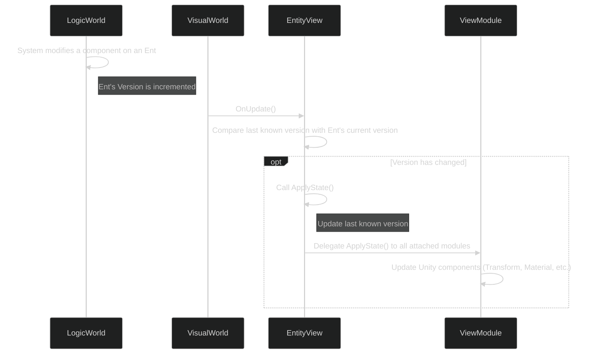

# 05: Rendering & The Views Module

ME.BECS maintains a strict separation between simulation logic and visual presentation. The **Views Module** is the official bridge that connects the data-oriented ECS world to Unity's `GameObject`-based rendering engine.

## The Core Concept: Reacting to State Changes

Views do not have direct access to modify the logic world. Instead, they **observe** the state of an entity and **react** when its data changes. This is achieved through the entity versioning system.



The `ApplyState()` method is the heart of the Views system. It is only called when an entity's data has been modified, making it a highly efficient way to keep visuals in sync with the game state.

## 1. `EntityView`: The `GameObject` Representative

An `EntityView` is a `MonoBehaviour` that you place on a prefab. It represents a single ECS entity in the `GameObject` world.

*   **Link to ECS:** It holds a reference to the `Ent` it represents.
*   **View Modules Container:** Its primary job is to act as a container for one or more `ViewModule` components. It receives the `ApplyState` call and delegates it to its modules.
*   **Prefab Asset:** You create a prefab with an `EntityView` component and any other necessary `MonoBehaviour`s (like `ViewModule`s). This prefab is then referenced in an `EntityConfig` to be spawned at runtime.

## 2. `ViewModule`: Compositional & Reusable Logic

A `ViewModule` is a `MonoBehaviour` that contains a specific piece of visual logic. Instead of creating a monolithic `PlayerView` `MonoBehaviour` that handles movement, health bars, and selection effects, you create small, reusable modules for each.

*   **`HealthBarViewModule`:** Observes the `Health` component and updates a UI slider.
*   **`TransformViewModule`:** Observes `Position` and `Rotation` components and updates the `GameObject`'s transform.
*   **`SelectionEffectViewModule`:** Observes an `IsSelected` component and enables/disables a projector or outline effect.

This compositional approach is more flexible and maintainable than inheritance.

### Example `ViewModule`:

```csharp
using ME.BECS;
using ME.BECS.Views;
using UnityEngine;

// A module to handle updating the GameObject's position
public class TransformViewModule : ViewModule
{
    // This method is called by the EntityView when the entity's version changes
    public override void ApplyState(in Ent ent)
    {
        // Check if the entity has the required components
        if (ent.Has<Position>() == true && ent.Has<Rotation>() == true)
        {
            // Read the data from the ECS components
            var position = ent.Read<Position>().value;
            var rotation = ent.Read<Rotation>().value;

            // Apply the state to the Unity Transform
            this.transform.position = position;
            this.transform.rotation = rotation;
        }
    }
}
```

## 3. Culling: Optimizing View Updates

The Views system includes a powerful culling mechanism to save performance on objects that are not visible to the camera.

*   **`CullingType`:** On the `EntityView` component, you can set a `CullingType`.
*   **Behavior:** When an entity is culled (e.g., outside the camera's frustum), the framework will stop calling `OnUpdate()` and `ApplyState()` on its `EntityView` and all associated `ViewModule`s.
*   **Performance Gain:** This is a significant optimization, as it prevents expensive visual update logic from running on thousands of off-screen entities.
*   **Camera Injection:** To make culling work, the `ViewsModule` on your `WorldInitializer` needs a reference to the main camera, which is typically injected by adding a `CameraAspect` to the module.

By using this architecture, you maintain a clean separation between your deterministic game logic and your presentation layer, while still having a powerful and efficient pipeline for rendering your ECS world.
