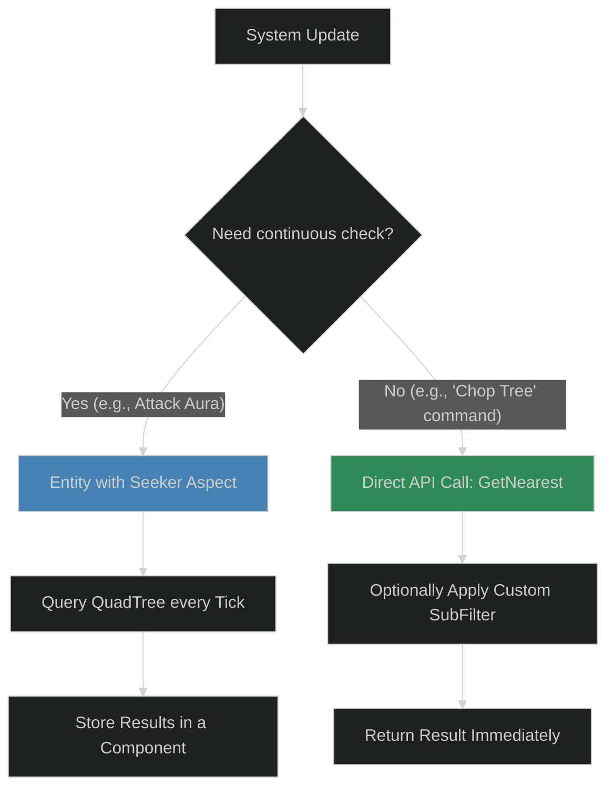
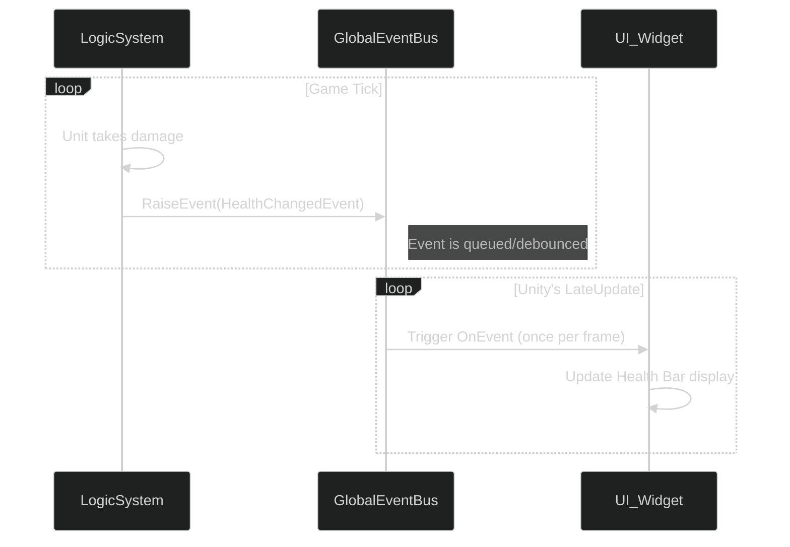

# 07: Advanced Topics & Addons

This document covers several powerful, specialized features and addons within ME.BECS that are crucial for building a complete game.

## 1. Trees: Deterministic Spatial Partitioning

Because Unity's `Physics` module is non-deterministic, ME.BECS provides its own solution for spatial queries and collision detection: the **Trees Addon**. This addon uses data structures like QuadTrees (for 2D/top-down 3D) or Octrees (for full 3D) to efficiently and deterministically find entities within a given area.

### Workflows for Using Trees:

1.  **Continuous Queries (Seekers):**
    *   **Use Case:** An entity needs to constantly be aware of its surroundings, like a turret looking for targets or a unit with a damage aura.
    *   **Implementation:** Add a `QuadTreeQuery` aspect (a "Seeker") to your entity. The framework will automatically query the tree every tick and store the results (e.g., a list of nearby entities) in a component on your seeker entity. Your systems can then simply read the results from that component.

2.  **One-Off Queries (Direct API):**
    *   **Use Case:** You need to find something in response to a single event, like finding the nearest resource when a worker is given a "gather" command.
    *   **Implementation:** Use the direct API provided by the Tree system (e.g., `QuadTree.GetNearest()`). This is more efficient than creating a persistent Seeker entity for a one-time check.
    *   **Sub-Filtering:** You can provide a custom `ISubFilter` struct to the query to further refine the results (e.g., "Find the nearest enemy unit with less than 50% health").

## 2. Players & Teams: Ownership and Metadata

In many games, especially multiplayer ones, you need to track which player owns which units and how they relate to each other (friend or foe).

*   **Player Entity:** A `Player` is a distinct entity that represents the human connection or an AI player. It is separate from the units that player controls. A common strategy is to derive the `PlayerID` from the `ClientID` (e.g., `PlayerID = ClientID + 1`), reserving Player 0 for neutral or environment-owned entities.
*   **Team Entity:** A `Team` is also an entity. Players are assigned to a team.
*   **Ownership:** Game units (e.g., soldiers, workers) have a component that stores the `Ent` of the player who owns them.
*   **Updating Masks:** When team assignments change, you must call `UpdateTeams` to refresh the internal collision and interaction masks, which are used by systems like the Trees addon to correctly identify friends, foes, and neutral parties.

## 3. Global Events: Communicating with UI

Directly querying ECS data from a `MonoBehaviour` every frame is inefficient and breaks the separation of concerns. The recommended way for the ECS world to communicate with the UI (or other `GameObject`-based systems) is via a **Global Event Bus**.

*   **Workflow:**
    1.  A logic system detects a state change (e.g., health changes, a unit dies).
    2.  It raises a global event, which is a simple `struct`.
    3.  The `GlobalEventBus` accumulates all events fired within a single tick.
    4.  At the end of the frame, it de-bounces them and triggers callbacks on any UI widgets or `MonoBehaviour`s that are listening for that event type.
*   **Benefit:** This ensures the UI only redraws once per frame with the latest data, even if the underlying data changed multiple times during the logic tick. It's a highly decoupled and performant way to drive UI from ECS state.

## 4. CSV Configs Importer: Data-Driven Design

The **CSV Configs Importer** is a powerful editor tool that allows you to define your `EntityConfig` data in a Google Sheet and import it directly into Unity.

*   **Workflow:**
    1.  Create a Google Sheet with columns corresponding to your component fields.
    2.  Publish the sheet to the web as a CSV file.
    3.  In Unity, create an `Entity Config CSV Importer` asset.
    4.  Paste the CSV URL into the importer asset and click `LOAD`.
*   **Benefit:** This enables a rapid, data-driven iteration loop. Designers can balance units, define items, and tweak stats in a spreadsheet without needing to open the Unity editor or have a programmer make changes. The tool also supports cross-linking between configs within the sheet.
