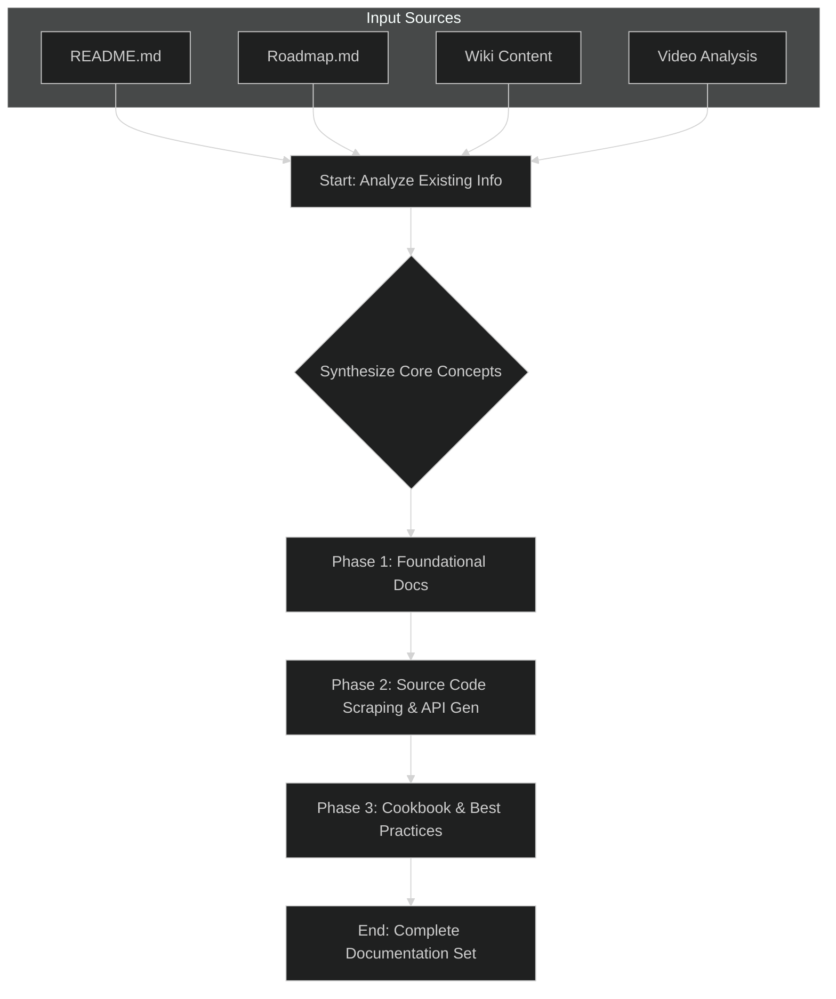

# ME.BECS Documentation Generation Plan

This document outlines the strategy and structure for creating comprehensive technical documentation for the ME.BECS framework. The primary goal is to produce a set of documents that will allow a senior programmer to quickly understand the framework's architecture, core concepts, development workflows, and critical constraints.

## Guiding Principles

1.  **Architecture-First:** The documentation will prioritize explaining the high-level architecture (World hierarchy, data flow, networking model) before diving into specific APIs.
2.  **Diagram-Driven:** Every major concept will be introduced with a Mermaid diagram to provide an immediate visual mental model.
3.  **Prescriptive & Practical:** The docs will offer clear "Do's and Don'ts" based on the framework's constraints (e.g., data types in components, job management, determinism).
4.  **Source Code as Ground Truth:** While existing docs and videos provide context, the final API reference will be generated by scraping the C# source code to ensure accuracy and completeness.

## Proposed Documentation Structure

The documentation will be organized into the following sections, each corresponding to a separate Markdown file.

1.  **Introduction (`00-Introduction.md`)**
    *   What is ME.BECS?
    *   Core benefits (Performance, Determinism, Networking).
    *   When to choose ME.BECS over Unity's standard ECS.

2.  **Getting Started (`01-Getting-Started.md`)**
    *   Project setup (dependencies, `csc.rsp`, unsafe code).
    *   Singleplayer vs. Multiplayer project initialization.
    *   Creating the "Hello World" system and connecting it in the Feature Graph.

3.  **Core Architecture (`02-Core-Architecture.md`)**
    *   **The World Hierarchy:** Detailed explanation of the Logic vs. Visual world setup.
    *   **Execution Order & The Update Loop:** How systems are executed and how `JobHandle` dependencies are managed.
    *   **Memory Management:** Overview of the custom allocators and the zero-GC philosophy.

4.  **Fundamental Concepts (`03-Fundamental-Concepts.md`)**
    *   **Entities:** Lifecycle (`New`, `Destroy`), identity, and versioning.
    *   **Components:** The data containers. Critical constraints (structs, blittable types, no `bool`, no classes).
    *   **Aspects:** The primary tool for high-performance data access.
    *   **Systems:** The logic containers (`IAwake`, `IUpdate`, etc.) and their connection to the Feature Graph.

5.  **Data & Logic Workflows (`04-Data-Logic-Workflows.md`)**
    *   **Queries & Jobs:** How to iterate over entities and schedule parallel jobs (`IJobForAspects`, `IJobForComponents`).
    *   **Entity Configs:** The "prefab" system of ME.BECS. Static vs. Dynamic components, inheritance, and join options.
    *   **The Feature Graph:** The central tool for wiring systems and features together.

6.  **Rendering & Views (`05-Rendering-and-Views.md`)**
    *   **The Views Module:** The bridge between the ECS world and Unity's `GameObject` world.
    *   **EntityView & ViewModule:** The compositional approach to rendering.
    *   **The `ApplyState` Pattern:** How views react to state changes via entity versioning.
    *   **Culling:** Optimizing view updates.

7.  **Networking Model (`06-Networking.md`)**
    *   **Architecture:** Input prediction, server authority, and the rollback/replay mechanism.
    *   **Network Events & Commands:** Sending input and state changes over the network.
    *   **Determinism:** Best practices for writing deterministic logic (using framework-provided Random/Math).

8.  **Advanced Topics & Addons (`07-Advanced-Topics.md`)**
    *   **Trees (Spatial Partitioning):** The deterministic replacement for a physics engine. Seeker aspects vs. direct API calls.
    *   **Players & Teams:** Managing ownership and relationships.
    *   **Global Events:** Communicating with UI and other non-ECS systems.
    *   **Data Importers:** Using the CSV importer for data-driven design.

9.  **API Reference (Generated) (`API/`)**
    *   A directory of Markdown files automatically generated from the source code.
    *   `API/Components.md`
    *   `API/Aspects.md`
    *   `API/Systems.md`
    *   `API/Core.md` (World, Ent, etc.)
    *   `API/Addons/...`

## Execution Plan

### Phase 1: Foundational Documentation Synthesis

- **Action:** Manually create the initial drafts for documents 00 through 07.
- **Source:** Synthesize information from `README.md`, the entire `ME.BECS.wiki`, and especially the detailed takeaways from `videos-analysis.md`.
- **Tools:** `read_many_files`, `write_file`.
- **Output:** A strong set of conceptual and architectural documents that explain the "why" and "how" of the framework.

### Phase 2: Source Code Analysis & API Reference Generation

- **Action:** Systematically "scrape" the ME.BECS C# source code to generate the API Reference section.
- **Strategy:**
    1.  Use `glob` to find all `*.cs` files within the `@ME.BECS/` directory (excluding tests).
    2.  Use `read_many_files` to load the content of all source files.
    3.  Process the text content to identify and extract information about:
        *   Structs implementing `IComponent`, `IAspect`, `ISystem`.
        *   Public methods, properties, and fields for key classes like `World`, `Ent`, `SystemContext`.
        *   Attributes like `[BurstCompile]`, `[InjectDeltaTime]`, `[EditorComment]`.
        *   XML documentation comments (`/// 
...`) to use as descriptions.
- **Tools:** `glob`, `read_many_files`, `write_file`.
- **Output:** A complete, accurate, and structured API reference in the `API/` directory.

### Phase 3: Cookbook and Final Review

- **Action:** Create a final `Cookbook-Best-Practices.md` document.
- **Source:** Review all previously generated documents and extract all prescriptive advice (Do's/Don'ts) into a single, easy-to-reference guide.
- **Review:** Read through the entire documentation set to ensure consistency, add cross-links between the conceptual docs and the API reference, and polish the language.
- **Tools:** `read_many_files`, `write_file`.
- **Output:** A polished and complete documentation set ready for a developer.
